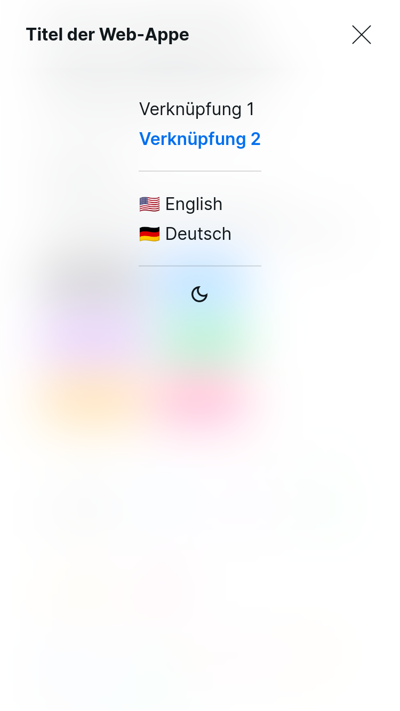
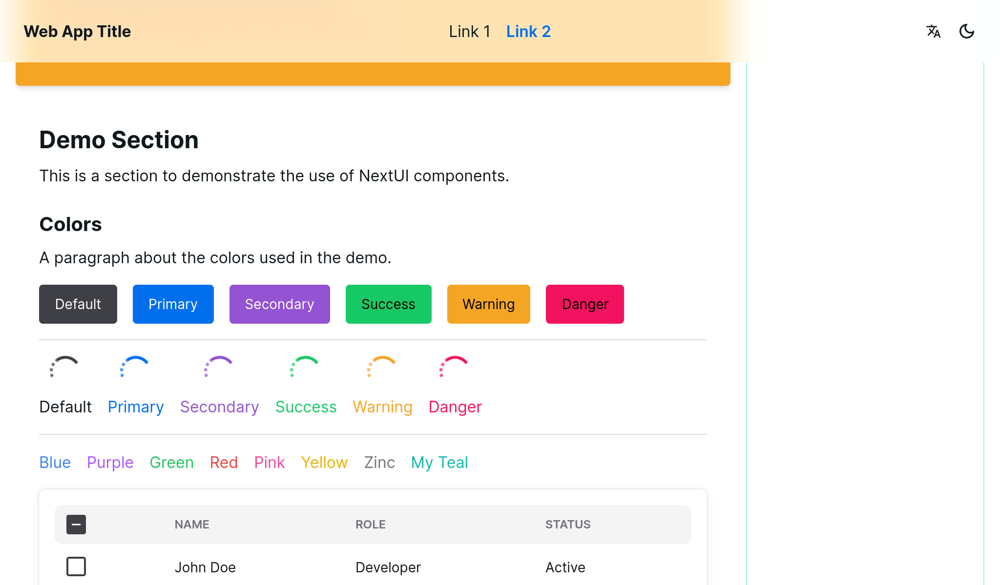
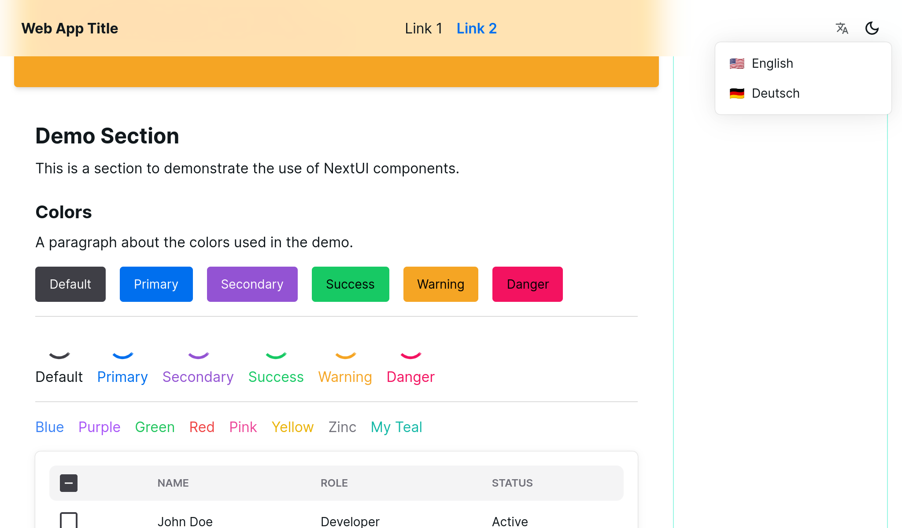
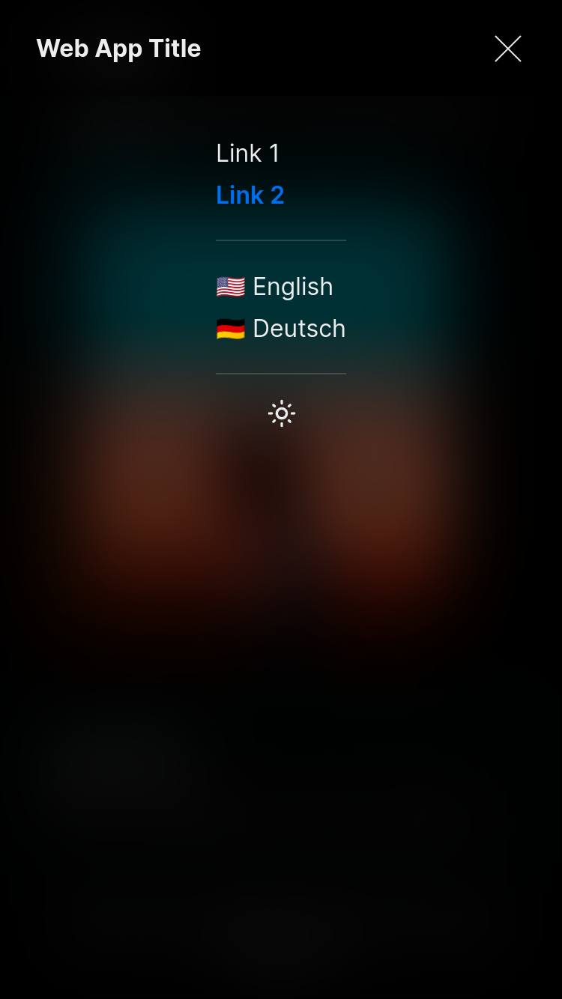
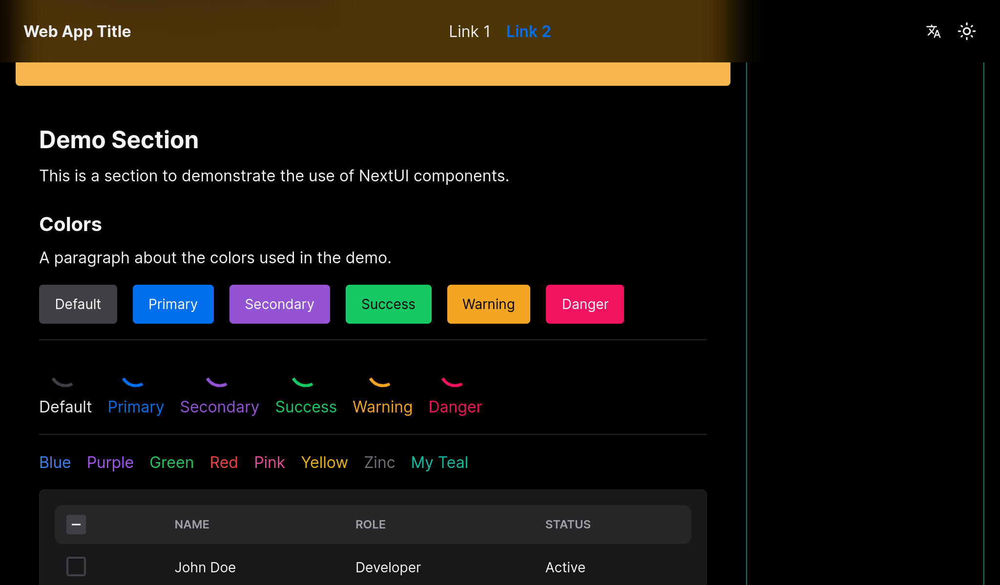
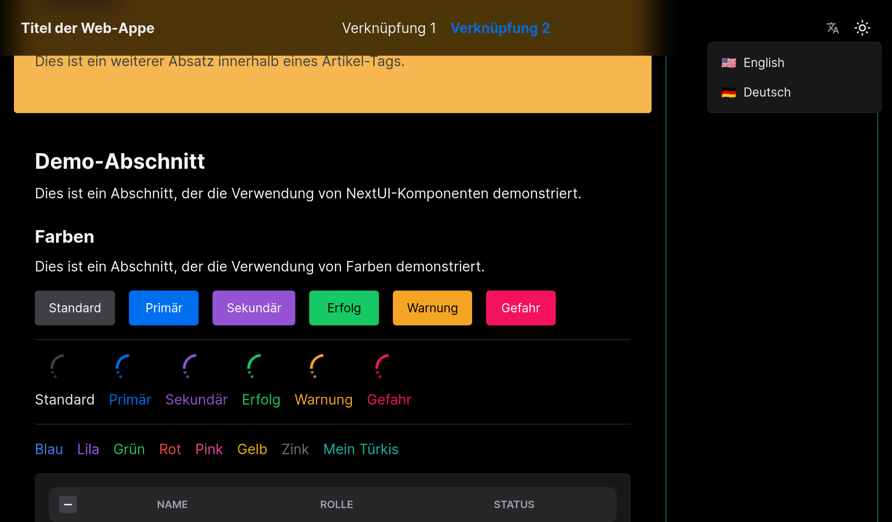

# Next.js Template: Hera

## Hebe (/ˈhiːbiː/; Greek: Ἥβη)

Often given the epithet Ganymeda (meaning "Gladdening Princess"), she is the goddess of youth or of the prime of life. She functions as the cupbearer for the gods and goddesses of Mount Olympus, serving their nectar and ambrosia. People of Sicyon also worship her as the goddess of forgiveness or of mercy.

Hebe is a daughter of Zeus and [Hera](https://github.com/dimitrios-git/next.js-templates/tree/main/next.js-template-hera), and the divine wife of Heracles (Roman equivalent: Hercules).

## The Project

This is a [Next.js](https://nextjs.org/) template project, that uses TypeScript, Tailwind CSS, ESLint and [NextUI](https://nextui.org/).

This template is responsive and designed with HTML5 semantics in mind. It has multi-language support, powered by `next-intl`, and dark mode support, powered by `next-themes`. Icons are provided by `react-icons`.

The NextUI library is fully integrated, with routing and theme customizations enabled. See [tailwind.config.ts](./tailwind.config.ts).

No backend functionality is provided.

### Screenshots

| Mobile                                                  | Desktop                                            | Dropdown                                                     |
| ------------------------------------------------------- | -------------------------------------------------- | ------------------------------------------------------------ |
|  |  |  |
|   |   |   |

## Getting Started

Install the dependencies:

```bash
npm install
# or
yarn
# or
pnpm install
# or
bun install
```

Then, run the development server:

```bash
npm run dev
# or
yarn dev
# or
pnpm dev
# or
bun dev
```

Open [http://localhost:3000](http://localhost:3000) with your browser to see the result.

You can start editing the page by modifying `@/app/[locale]/page.tsx`. The page auto-updates as you edit the file.

This project uses [`next/font`](https://nextjs.org/docs/basic-features/font-optimization) to automatically optimize and load Inter, a custom Google Font.

## Learn More

To learn more about Next.js, take a look at the following resources:

- [Next.js Documentation](https://nextjs.org/docs) - learn about Next.js features and API.
- [Learn Next.js](https://nextjs.org/learn) - an interactive Next.js tutorial.
