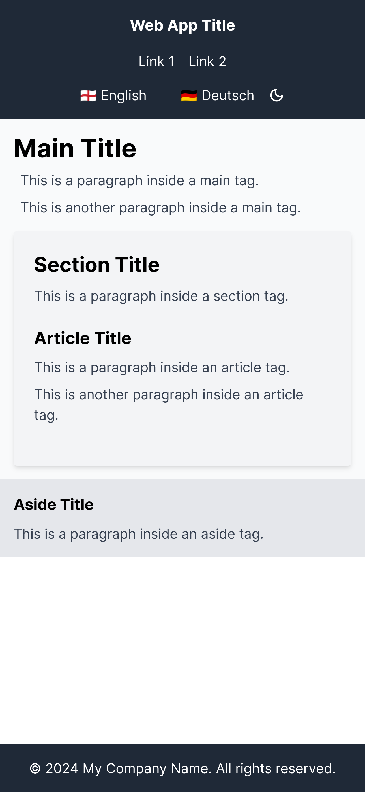
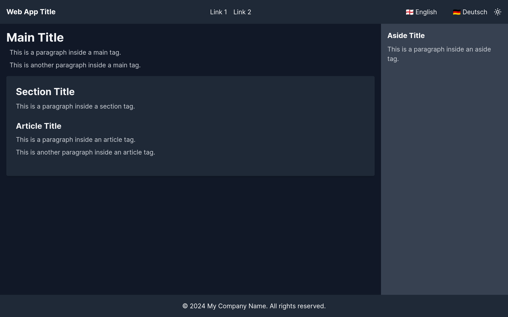

# Next.js Template: Hera

## Hera (Ἥρα, Hḗra)

Queen of the gods, and goddess of women, marriage, childbirth, heirs, kings, and empires. She is the goddess of the sky, the wife and sister of Zeus, and the daughter of Cronus and Rhea. She was usually depicted as a regal woman in the prime of her life, wearing a diadem and veil and holding a lotus-tipped staff. Although she is the goddess of marriage, Zeus's many infidelities drive her to jealousy and vengefulness. Her sacred animals include the heifer, the peacock, and the cuckoo. Her Roman counterpart is Juno.

## The Project

This is a [Next.js](https://nextjs.org/) template project, that uses TypeScript, Tailwind CSS, and ESLint.

This template has is responsibe and designed with HTML5 semantics in mind. It has multi-language support, powered by `next-intl`, and dark mode support, powered by `next-themes`. Icons are provided by `react-icons`.

No UI library is used, so you can use your own components or any other UI library.

### Screenshots

#### Light Mode on Mobile



#### Dark Mode on Desktop



## Getting Started

First, run the development server:

```bash
npm run dev
# or
yarn dev
# or
pnpm dev
# or
bun dev
```

Open [http://localhost:3000](http://localhost:3000) with your browser to see the result.

You can start editing the page by modifying `@/app/[locale]/page.tsx`. The page auto-updates as you edit the file.

This project uses [`next/font`](https://nextjs.org/docs/basic-features/font-optimization) to automatically optimize and load Inter, a custom Google Font.

## Learn More

To learn more about Next.js, take a look at the following resources:

- [Next.js Documentation](https://nextjs.org/docs) - learn about Next.js features and API.
- [Learn Next.js](https://nextjs.org/learn) - an interactive Next.js tutorial.
